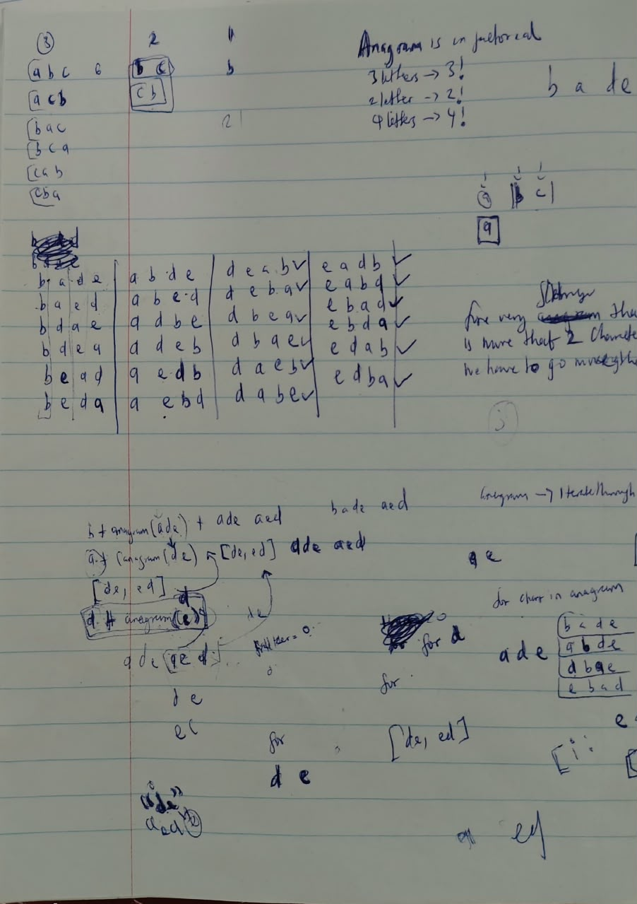
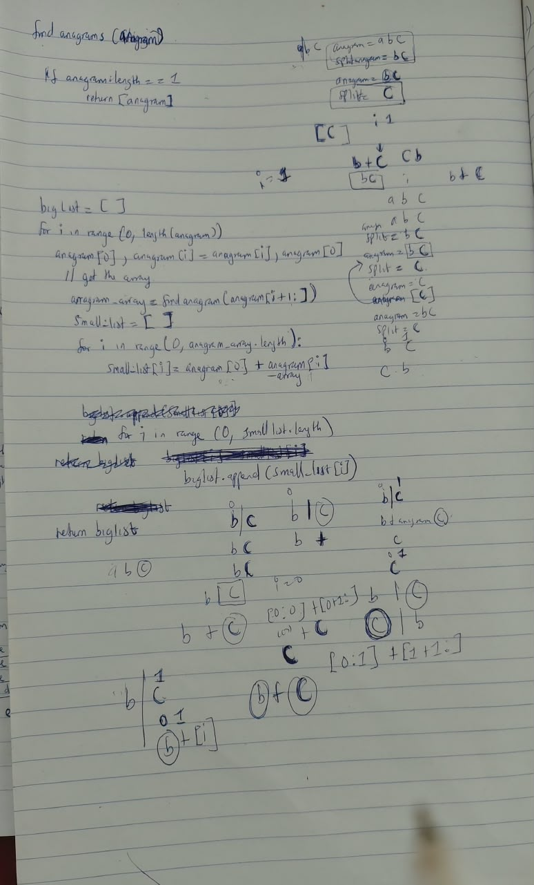

# Finding All Anagrams of a String (Recursion)

## The Problem

Given a string, return every possible ordering (permutation) of its
characters, each one using every character exactly once.

## Step One: Finding the Pattern by Hand

Before writing any code, the first move was to work out small examples by
hand and count how many anagrams each one had:

- `"a"` → 1 anagram
- `"bc"` → 2 anagrams
- `"abc"` → 6 anagrams
- `"bade"` → 24 anagrams

1, 2, 6, 24, that's the factorial sequence. The number of anagrams of a
string is the factorial of its length. If the problem only asked for the
*count* of anagrams, that fact alone would be the entire answer, no
recursion or array-building needed, just compute the factorial of the
length. But the actual problem asks for the anagrams themselves, so the
factorial insight only confirms *how many* results to expect, not what
they are.

## Step Two: The Two Recursive Mental Models

The book's advice for recursion is to think top-down, and two ways of
doing that stood out:

1. **Assume someone else already wrote the recursive function correctly**,
   trust it to do its job on a smaller version of the problem, and just
   build on top of whatever it hands back.
2. **Find the sub-problem**, a smaller version of the exact same problem,
   hiding inside the original one.

## Step Three: Spotting the Sub-Problem

Working through `"bade"` by hand, writing out every one of its 24
orderings, the sub-problem became clear: pull off the first character,
and treat the *rest* of the string as its own, smaller anagram problem.

For `"bade"`: removing `"b"` leaves `"ade"`, a 3-character sub-problem
with 3! = 6 anagrams of its own. Each of those six `"ade"` anagrams turns
into a full `"bade"` anagram once `"b"` is put back on the front of it,
one quarter of the 24 total, right there. Since every character gets its
own turn being pulled out first, the other three characters (`a`, `d`,
`e`) each produce their own group of 6 as well, and 4 × 6 = 24, matching
the factorial count found earlier.

That's the recursive shape: for every character in the string, pull it
out, recursively find every anagram of what's left, then glue that
character back onto the front of each of those smaller anagrams.



## Step Four: The Bracket Notation

Working out how this would actually flow in code, including how the
recursion eventually comes back and gets combined (the backtracking
part), the pseudocode used three kinds of brackets to keep the pieces
straight:

- `{ }`, the base case list: what gets returned when there's nothing left
  to recurse on.
- `( )`, the small list: the current character glued onto the front of
  each anagram coming back from the recursive call on the rest of the
  string.
- `[ ]`, the big list: where every small list gets collected, across
  every character's turn at the front, this is what the function
  ultimately returns.

![Tracing find_anagram("abc") through the recursive calls with the {}/()/[] notation](../whiteboard/anagram/anagram_2.jpeg)

## Step Five: Writing the General Method

Since this has to work for a string of any length, the function needs:

- a loop over every character in the string (each one gets a turn being
  pulled out front)
- string slicing, to build "the rest of the string" with one character
  removed
- a recursive call on that sliced-down remainder
- another loop, to glue the pulled-out character onto every anagram the
  recursive call returns
- a final loop, to append each of those combined anagrams into the big
  list being returned



## Step Six: A Debugging Detour

The first working attempt (`anagrams.py`) reused the letter `i` as the
loop variable in all three loops: the outer loop over each character, and
both inner loops. That's a real bug, not just a style choice; once the
first inner loop runs `for i in range(0, len(anagram_array))`, it
overwrites the outer loop's `i` for the rest of that pass through the
outer loop. So by the time the code tries to grab "the character
currently pulled out front" using `anagram[i]`, `i` no longer holds the
outer loop's position at all, it's leftover from the inner loop, pointing
at the wrong character entirely. Printing the values of `anagram`, `i`,
and the in-progress lists at each step (still in that file) is what made
the mismatch visible.

The fix (`anagrams_correct.py`) was to give every loop its own name,
`char` for the outer loop, `pair` for the first inner loop, `element` for
the second, so each one keeps its own value independent of the others.
Once that was in place, running it produced exactly the expected
anagrams.

## The Code (Python: `anagrams_correct.py`)

```python
def findAnagram(anagram):
    if len(anagram) == 0:
        return []
    if len(anagram) == 1:
        return [anagram]

    bigList = []
    for char in range(0, len(anagram)):
        anagram_array = findAnagram(anagram[0:char] + anagram[char+1:])
        smallList = []
        for pair in range(0, len(anagram_array)):
            smallList.append(anagram[char] + anagram_array[pair])

        for element in range(0, len(smallList)):
            bigList.append(smallList[element])

    return bigList

print(findAnagram("bade"))
```

## The Code (TypeScript translation)

```typescript
function findAnagram(anagram: string): string[] {
  if (anagram.length === 0) {
    return [];
  }
  if (anagram.length === 1) {
    return [anagram];
  }

  const bigList: string[] = [];
  for (let char = 0; char < anagram.length; char++) {
    const anagramArray = findAnagram(anagram.slice(0, char) + anagram.slice(char + 1));
    const smallList: string[] = [];
    for (let pair = 0; pair < anagramArray.length; pair++) {
      smallList.push(anagram[char] + anagramArray[pair]);
    }

    for (let element = 0; element < smallList.length; element++) {
      bigList.push(smallList[element]);
    }
  }

  return bigList;
}

console.log(findAnagram("bade"));
```

Running it prints all 24 anagrams of `"bade"`, matching the factorial
count worked out by hand in Step One.
